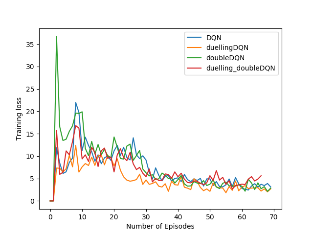

## Batlle Of Deep Q-Nets

This repo contains implementations of Deep Q Network(DQN) and its variants: Double DQN and Duelling DQN. A variant which uses a duelling architecture and calculates loss in Double DQN style is also included. For evaluating performance, PongDeterministic-v4 was used since it converges very fast.

### References:
* [DQN paper](https://www.cs.toronto.edu/~vmnih/docs/dqn.pdf)
* [Double DQN paper](https://arxiv.org/abs/1509.06461)
* [Duelling DQN paper](https://arxiv.org/abs/1511.06581)

### Code Reference:
The code is highly inspired from <https://github.com/higgsfield/RL-Adventure>. The network architecture and hyperparameters are directly borrowed from this repo.

## Rewards vs Episodes:

## Loss vs Episodes:

